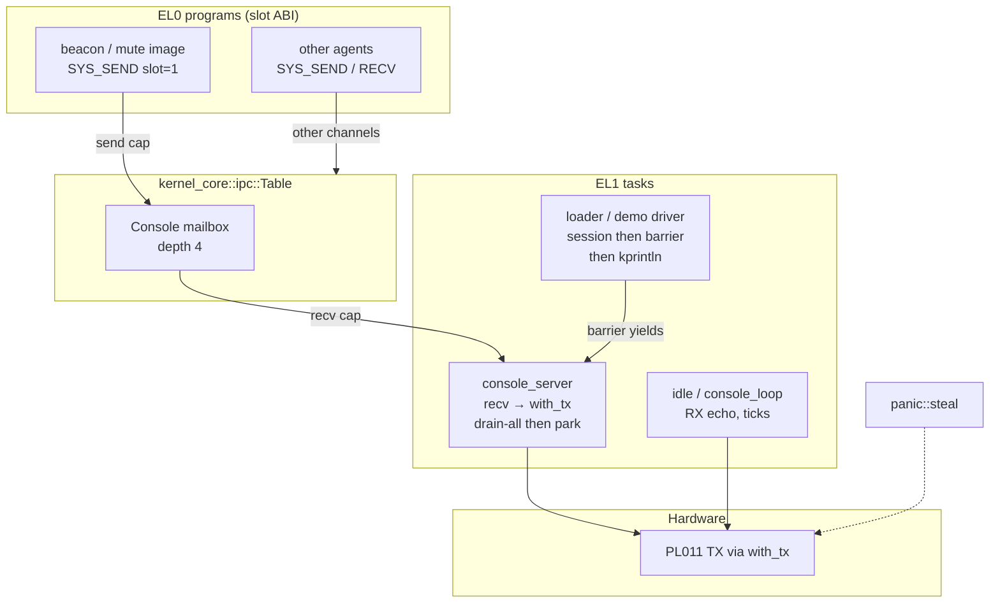
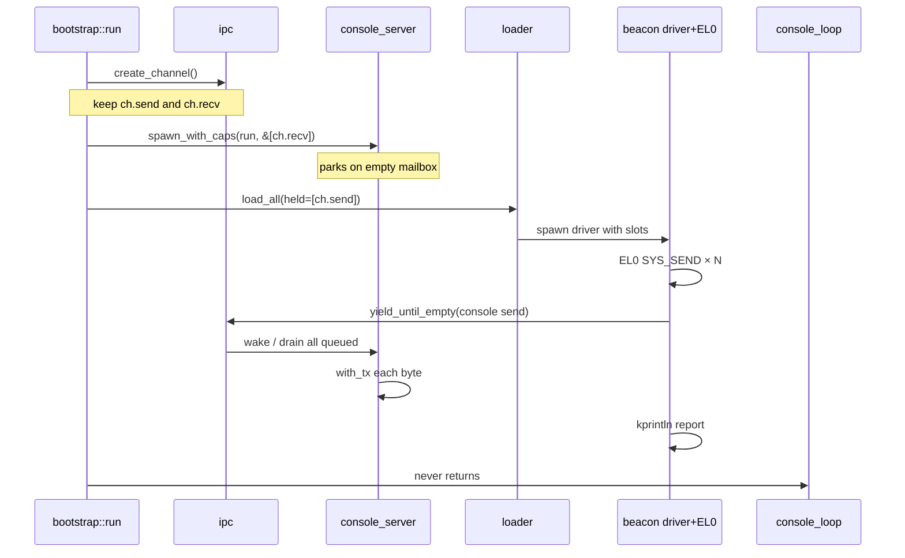
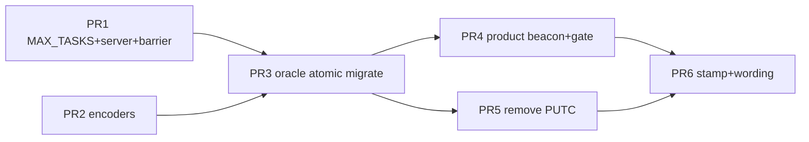

# M8: The console becomes an endpoint

| Field   | Value |
| ------- | ----- |
| Project | Harbor Kernel (`harbor-kernel`) |
| Issue   | [#12](https://github.com/gianlucamazza/harbor-kernel/issues/12) |
| Author  | (design draft) |
| Date    | 2026-08-07 |
| Status  | **Draft** (rev 4 — open questions closed by user) |
| Depends | M0–M7 on silicon; ADR-0021 (loader); ADR-0022 (blocking recv); ADR-0017 §3–§4 (console cap + successor named) |

---

## Overview

Today an EL0 agent that holds the console capability writes the UART through a **kernel special case**: `SYS_PUTC` (imm 2) looks up a slot, checks `console::is_console_cap`, and drains one byte via `console::with_tx` inside the agent session loop (`src/agent/mod.rs`). That path is transitional by design ([ADR-0017](../adr/0017-el0-capability-abi.md) §4): the same slot already names a send capability on a console channel; only who drains the mailbox differs (kernel today, server tomorrow).

M8 completes that isomorphism. Bootstrap already mints the console channel and grants the **send** end (`src/bootstrap/mod.rs` → `console::grant_console_cap(ch.send)`), but the **recv CapId is discarded** — the endpoint stays live and holderless, so nobody can drain. A resident **EL1 console server** will hold that recv end, park on `ipc::recv` when the mailbox is empty, and write each drained byte through the shared kernel TX handle. Creators that need “bytes before report” on the wire call a cooperative **drain barrier** before `kprintln!`. `SYS_PUTC` is removed from the ABI. Agents print with `SYS_SEND` on the same slot. The console remains **denied by default**; `boot-check` continues to assert that the deliberately denied byte never reaches the wire.

**Product split:** the server is always-on EL1 infrastructure; the first **product manifest inhabitant** is a **beacon** agent that exercises the endpoint. That reading of issue #12 / ADR-0021 / architecture M8 is stated explicitly under [Done-when interpretation](#done-when-interpretation).

---

## Background & Motivation

### Current state (post-M7, 2026-08-07)

| Piece | Location | Behaviour |
| ----- | -------- | --------- |
| Console capability | `src/console.rs` (`CONSOLE_CAP`, `grant_console_cap`, `is_console_cap`) | Named once at boot; checked only on `SYS_PUTC` |
| Channel mint | `src/bootstrap/mod.rs` (~L399–408) | `create_channel()`; send granted; **recv CapId discarded** (endpoint left holderless; not released — generation debt) |
| `SYS_PUTC` dispatch | `src/agent/mod.rs` (`Syscall::Putc`) | Slot → hold check → `is_console_cap` → `uart.write_byte` **before** creator `kprintln` |
| `SYS_SEND` / `SYS_RECV` | `src/ipc/mod.rs`, `kernel_core::ipc::Message` | Mailbox depth **4**, max 8 mailboxes, 16 endpoints (ABI, ADR-0017) |
| Idle body | `src/bootstrap/console_loop.rs::run` | RX echo, tick reports, `WFI` / yield — owns no exclusive `Pl011` after `install_tx` |
| Product manifest | `src/bootstrap/loader.rs` | Empty without `oracle`; oracle has `echo` / `mute` (`encode_putc_hi_exit`) |
| Product gap | `scripts/boot/product-image.sh`, `docs/architecture.md` rule 9 | **36** unreachable items (architecture.md); issue #12 still says ~37 — pin to 36 at close |
| Task table | `sched::MAX_TASKS = 14` | Oracle boot uses **exactly 14** slots (idle + 13 spawns) |

### Oracle task census today (exact)

| Role | Count |
| ---- | ----- |
| Idle | 1 |
| Manifest `echo` + `mute` | 2 |
| `task-a`, `task-b`, `el0-task`, `pl011-agent`, `agent-a`, `agent-b` | 6 |
| M4 `ipc` receiver / sender / forger | 3 |
| el0-ipc receiver / sender | 2 |
| **Total** | **14** |

Any always-on server without raising `MAX_TASKS` fails late spawns with `SpawnError::Full` (same class of failure that forced 12 → 14 when the loader landed).

### Pain points

1. **Special-cased authority.** `SYS_PUTC` is the only path where a capability names an object that the kernel drains instead of a mailbox peer (`ipc::note_authority_refusal` documents this exception).
2. **Empty product surface.** The loader is product code and creates no tasks without the oracle.
3. **Recv CapId discarded.** Send is real; nobody holds recv, so the isomorphism cannot be exercised.
4. **Rule 6.** Drain must be voluntary, never inside an IRQ handler.
5. **Wire order.** Today putc is synchronous in the session; peer-task drain breaks `H!loader:` adjacency unless creators barrier (see below).

### What already points at the answer

```146:155:src/console.rs
/// Written once at boot with IRQs masked; read on the `SYS_PUTC` path.
static CONSOLE_CAP: SyncCell<Option<CapId>> = SyncCell::new(None);

/// Name the capability that stands for this console.
///
/// Called once, by bootstrap, with the send capability of the console channel.
/// Making it a channel's capability rather than a new kind of handle is what
/// lets M8 replace `SYS_PUTC` with `SYS_SEND` on the same slot without the
/// agent-side ABI changing: the authority is already the right one, only the
/// drain moves from the kernel to a server (ADR-0017 §4).
```

---

## Goals & Non-Goals

### Goals

1. An **EL1 console server** drains the console mailbox and writes the UART on the voluntary path.
2. **`SYS_PUTC` is gone** from the decode table (imm 2 → `Unknown`), removal recorded in `SECURITY.md`, architecture, and `make doc-claims`.
3. Console **denied by default**; `boot-check` asserts denied byte absent (`Xel0` never appears).
4. **Product image** creates ≥1 task (server) and a **non-empty product manifest** (beacon); `make product-builds` unreachable count falls from the pinned baseline **36**.
5. Creator **drain barrier** preserves wire-order proof where boot-check needs it (`H!` then report).
6. QEMU `boot-check` green; silicon stamp + transcript in `docs/verification.md`.
7. `MAX_TASKS` raised so oracle boot cannot Full under the M8 census.

### Non-Goals

| Non-goal | Why |
| -------- | --- |
| Blocking `SYS_SEND` | Needs its own ADR (symmetric park to ADR-0022) |
| Multi-byte stream messages | Depth-4 + one-byte messages suffice for M8 |
| Replacing idle with interactive echo agent | Architecture non-goal |
| Kernel panic path through the server | Panic must `steal` TX |
| Preemption, SMP, IRQ-notification caps | Separate milestones |
| Capability transfer / revocation | Unchanged residual |
| Collapsing the ADR-0023 agent pair | Server is not an agent |
| UART RX ownership by the console server | RX stays kernel ring + idle / PL011 agent |
| Global exclusivity of the UART character stream | Only per-burst contiguity (server drain-all) |

---

## Done-when interpretation

Sources disagree slightly on *what* is the “first inhabitant.” This design freezes the reading.

| Source | Wording | Reading |
| ------ | ------- | ------- |
| ADR-0017 §4 | “tomorrow an **EL1 console server**” | Server is EL1 infrastructure |
| Architecture M8 row | “**product manifest stops being empty** — this is its first inhabitant” | First **manifest entry** is product surface |
| ADR-0021 consequences | “the **console endpoint** of M8 is the first thing the product would actually want **loaded**” | Endpoint *usage* is what product loads; not necessarily the drain loop as EL0 |
| Issue #12 body | “A console server is that thing — the **first entry a manifest carries**” | Body prose equates server with manifest entry |
| Issue #12 checkboxes | “EL1 **(or EL0)** console server” + “product image that creates at least one task” + unreachable falls | Checkboxes allow EL1 server and only require ≥1 task |

**Accepted interpretation (K1 + K2):**

1. **Console server = EL1 infrastructure** (not a manifest entry, not an ADR-0023 agent pair). Satisfies ADR-0017 §4 and the checkbox “EL1 (or EL0) console server.”
2. **Beacon agent = first product manifest inhabitant.** Proves the endpoint end-to-end; makes the product manifest non-empty; is what “loaded” means under ADR-0021.
3. Issue #12 body prose and architecture M8 wording are **updated in PR6** to match this split so closers do not re-litigate “is the client allowed to be the first inhabitant?”

**Rejected alternative for purity:** EL0 server that owns PL011 — dual-maps UART against kernel `with_tx` / panic steal. An EL0 “server” that only `SYS_RECV`s and somehow asks the kernel to TX is just the beacon/client design with extra cost.

---

## Key Decisions

| # | Decision | Rationale |
| - | -------- | --------- |
| K1 | **Console server is an EL1 kernel task**, not an ADR-0023 agent pair. | ADR-0017 §4; shared `with_tx`; panic steal; cost = 1 task slot + 16 KiB stack, no private AS. |
| K2 | **Final names:** product **beacon** (granted) + oracle **mute** (same image, no grant). **Delete `echo`.** **PR sequencing:** PR3 keeps the name **`echo`** while migrating to SEND; **PR4** renames the granted entry to **`beacon`**, makes it always-on product, oracle adds only mute. | Manifest non-empty + ADR-0021 same-image/table-diff. Saves one task vs keeping echo+beacon. Avoids PR3 grepping `beacon` before the name exists. |
| K3 | **Wire format:** one byte per `Message`; byte in `a[7:0]`; `tag = CONSOLE_TAG_BYTE` (0); `b = 0`. | Existing `Message`; one-for-one putc replacement. |
| K4 | **`SYS_PUTC` hard-removed** (imm 2 → `Unknown`); do not renumber 3–5. | Clean authority surface; doc-claims set comparison. |
| K5 | **Backpressure = `Status::Full`**. No blocking send. | Depth 4 is ABI; blocking send is separate ADR. |
| K6 | **Kernel TX stays kernel-owned.** Server, idle, demos, panic share / steal the same `Pl011`. Dual **TX entrypoints**, not dual drain of one queue. | Panic and bring-up must print without the server. |
| K7 | **Delete `grant_console_cap` / `is_console_cap` / `CONSOLE_CAP` in PR5.** Console authority is ordinary `CapRights::SEND`. | No reader after putc removal; dead diagnostic hooks forbidden. |
| K8 | **Wake only on voluntary send path.** Never TX from IRQ. | Rule 6; ADR-0008. |
| K9 | **Oracle denial demos stay**; encodings become SEND; refuse count exact and re-enumerated in PR3. | Doctrine: protection fires on the good path. |
| K10 | **Idle keeps RX echo and tick reports.** Server does not own RX. | Separates TX product surface from RX policy. |
| K11 | **Creator drain barrier** after console-using sessions before report `kprintln!`. | Preserves `H!` then report wire order; see [Ordering contract](#ordering-contract-creator-barrier). |
| K12 | **`MAX_TASKS = 16`** in PR1 (was 14). `MIN_SPARE_TABLES` derives automatically; confirm `link.ld` arena still covers. | Oracle post-M8 census = 15; +1 spare avoids Full-at-capacity. |
| K13 | **Server drains all currently queued console messages before parking** (no yield on the non-empty path). | Preserves `H!` contiguity once barrier runs. |
| K14 | **Product gate is concrete** in `check-product-image.sh` **and a mandatory product QEMU smoke in `make check`** — not “server alone stretches issue #12.” | Architecture M8 requires non-empty manifest; PR4 required. |
| K15 | **Barrier default `max_yields = 64`** (`ipc::YIELD_UNTIL_EMPTY_DEFAULT` or equivalent constant). | Depth 4; empty appears in few yields if server is live; bound avoids infinite spin. |
| K16 | **Unknown console `tag` values: drop only** — no counter, no TX. | M8 keeps the server minimal; counters deferred. |

---

## Proposed Design

### Architecture



### Boot sequence (product path)



### Console server body

**Module:** `src/bootstrap/console_server.rs` (bootstrap already composes `sched` + `ipc` + `console`; do not make `console` import `ipc`).

**Spawn (product path, before `load_all`):**

```rust
// src/bootstrap/mod.rs — product path (not cfg(oracle) for server spawn).
// Through PR1–PR4, SYS_PUTC is still a live TX entrypoint and still checks
// is_console_cap — so grant_console_cap MUST remain until PR5 removes putc.
match ipc::create_channel() {
    Ok(ch) => {
        console::grant_console_cap(ch.send); // keep until PR5
        match sched::spawn_with_caps(console_server::run, &[ch.recv]) {
            Ok(_) => kprintln!("console-server: up"),
            Err(e) => kprintln!("console-server: spawn FAILED {e:?}"),
        }
        // held[0] for the loader = ch.send
        Some(ch.send)
    }
    // ...
}
```

**Server loop (real APIs):**

```rust
// src/bootstrap/console_server.rs
pub fn run() {
    let Some(cap) = sched::my_cap(0) else {
        // spawn_with_caps always places recv at slot 0; empty = bootstrap bug.
        kprintln!("console-server: no recv cap at slot 0");
        return;
    };
    loop {
        // Blocking recv: parks when empty (EL1 path, ADR-0022).
        // Idle never holds this cap — ipc::recv refuses idle.
        match ipc::recv(cap) {
            Ok(first) => {
                // Drain-all: process first + any further queued messages
                // without yielding, so a multi-byte burst stays contiguous
                // on the wire once this task runs (K13).
                write_console_msg(first);
                while let Ok(msg) = ipc::try_recv(cap) {
                    write_console_msg(msg);
                }
                // Loop back to blocking recv → park if empty.
            }
            Err(ipc::RecvError::BadCap | ipc::RecvError::Busy) => {
                kprintln!("console-server: recv FAILED");
                return;
            }
            Err(ipc::RecvError::Empty) => {
                // Blocking recv never returns Empty for non-idle.
                kprintln!("console-server: unexpected Empty");
                return;
            }
        }
    }
}

fn write_console_msg(msg: ipc::Message) {
    if msg.tag != CONSOLE_TAG_BYTE {
        // Unknown tag: drop only (K16). No counter, no TX.
        return;
    }
    let byte = (msg.a & 0xFF) as u8;
    let _ = console::with_tx(|uart| uart.write_byte(byte));
    // After panic steal, with_tx is None: drop.
}
```

`sched::my_cap(0)` is the established EL1 pattern (`demos::ipc_receiver`).

### Ordering contract (creator barrier)

#### Problem

Under putc, bytes hit the UART **inside** `run_user_prog_resuming`, before the driver prints `loader: … ran …`. That yields the literal log fragment `H!loader: echo ran…` that `scripts/boot/qemu-boot-check.sh` greps.

Under M8, `SYS_SEND` only enqueues. The driver does not yield between session end and `kprintln!`, so without a barrier the natural order is:

1. `loader: beacon ran sends=2…`
2. later `H!` (after a switch to the server)

That fails adjacency greps and weakens the wire proof.

#### Solution: creator barrier (preferred)

After any session that successfully sent console messages (or that the creator wants ordered relative to a report), the **driver task** waits until the console mailbox is empty, then prints.

**New IPC API** (names fixed in this design — use `yield_until_empty` everywhere, not `yield_until_drained`):

```rust
// crates/kernel-core/src/ipc.rs — Table method
impl Table<...> {
    /// Messages currently queued on the mailbox named by `cap`.
    ///
    /// # Rights
    /// Resolves the mailbox if `cap` is a live endpoint with **either**
    /// `CapRights::SEND` **or** `CapRights::RECV` (try SEND lookup, then RECV).
    /// Do **not** pass `SEND | RECV` as a single `need` to `lookup`: `contains`
    /// means “has all bits,” and no endpoint holds both rights.
    ///
    /// Both ends of the same channel must report the same depth (host-tested).
    /// Successful observation does **not** touch refusal counters.
    /// Dead / wrong-generation / wrong-rights → `Err(QueuedError::BadCap)`
    /// with **no** authority-counter bump (this is not a send/recv attempt).
    pub fn queued(&self, cap: CapId) -> Result<usize, QueuedError> { ... }
}

// src/ipc/mod.rs
/// Queued depth for the mailbox named by `cap`.
///
/// # Hold check
/// Caller must `current_holds(cap)` first (same structural gate as send/recv).
/// Not held → `Err(QueuedError::BadCap)` **without** `note_authority_refusal`
/// (EL1 observation helper for the creator barrier, not an agent syscall).
/// On hold: `Table::queued` as above (SEND **or** RECV end).
///
/// The creator barrier always passes the **send** capability the driver already
/// holds at `CONSOLE_SLOT` after a granted session — that is the common path.
/// RECV is accepted so a holder of only the recv end (e.g. the server itself
/// in tests) sees the same depth.
pub fn queued(cap: CapId) -> Result<usize, QueuedError>;

/// Default yield budget for [`yield_until_empty`] (K15). Mailbox depth is 4;
/// empty should appear in a few yields if the server is live. Callers that need
/// a different bound pass it explicitly; boot demos and the loader use this.
pub const YIELD_UNTIL_EMPTY_DEFAULT: u32 = 64;

/// Cooperative wait until that mailbox is empty.
///
/// # Ordering / IRQs
/// Each observation takes the IPC mask briefly via `with_table` and **drops it**
/// before `sched::yield_now`. Must **not** be called from inside `without_irqs`
/// or any DAIF save/restore that would span the yield (architecture rule 7 /
/// ADR-0022 / `make irq-scope`).
///
/// Returns `Err(DrainError::Timeout)` if still non-empty after `max_yields`.
pub fn yield_until_empty(cap: CapId, max_yields: u32) -> Result<(), DrainError>;

/// Same as `yield_until_empty(cap, YIELD_UNTIL_EMPTY_DEFAULT)`.
pub fn yield_until_empty_default(cap: CapId) -> Result<(), DrainError> {
    yield_until_empty(cap, YIELD_UNTIL_EMPTY_DEFAULT)
}
```

**Loader / demo usage** (`src/bootstrap/loader.rs::run` and demos after console sessions):

```rust
// After run_user_prog_resuming, before the success kprintln:
if let Some(cap) = sched::my_cap(CONSOLE_SLOT) {
    // Driver holds the same slots as the EL0 program (spawn_with_slots).
    match ipc::yield_until_empty_default(cap) {
        // or: ipc::yield_until_empty(cap, ipc::YIELD_UNTIL_EMPTY_DEFAULT)
        Ok(()) => {}
        Err(e) => kprintln!("loader: {name} drain wait FAILED {e:?}"),
    }
}
// Now H! (or other bytes) are on the wire (if server ran).
kprintln!("loader: {name} ran sends={} refusals={}", stats.sends, stats.authority_refusals);
```

**Who may call:** any EL1 task that **holds** a send or recv cap on the mailbox (loader drivers hold console send at slot 1 when granted; mute has no cap — skip barrier). Not callable from IRQ. Not from idle (idle should not hold console caps).

**Mute / denial paths:** no successful enqueue → nothing to drain; barrier skipped; report may print immediately.

**el0-task / pl011 / el0-ipc receiver:** same pattern after sessions that SEND to console, so `H!` / `*` appear before the report line when greps care.

#### Boot-check contract (with barrier) — name follows the PR that owns it

| After | Granted agent name | Adjacency grep |
| ----- | ------------------ | -------------- |
| **PR3** (oracle still has `echo`) | `echo` | `H!loader: echo ran` |
| **PR4+** (final; product `beacon`) | `beacon` | `H!loader: beacon ran` |

**PR3 acceptance** (must be green before PR4):

```bash
grep -qa 'H!loader: echo ran' "${log}" || fail "…"
grep -qa 'loader: echo ran sends=2 refusals=0' "${log}" || fail "…"
grep -qa 'loader: mute ran sends=0 refusals=2' "${log}" || fail "…"
```

**Final / PR4+ acceptance:**

```bash
grep -qa 'H!loader: beacon ran' "${log}" || fail "…"
grep -qa 'loader: beacon ran sends=2 refusals=0' "${log}" || fail "…"
grep -qa 'loader: mute ran sends=0 refusals=2' "${log}" || fail "…"
```

If tick interleaving in the yield window proves flaky on QEMU, fall back to separate `H!` and report greps (weaker residual, not preferred).

**Sequencing rule:** do not require `beacon` greps in any PR that still ships the granted entry as `echo`.

### Wire format

Existing type (unchanged):

```29:34:crates/kernel-core/src/ipc.rs
#[derive(Clone, Copy, Debug, PartialEq, Eq)]
pub struct Message {
    pub tag: u32,
    pub a: u64,
    pub b: u64,
}
```

| Field | Console byte message | Notes |
| ----- | -------------------- | ----- |
| `tag` | `0` (`CONSOLE_TAG_BYTE`) | Named `pub const` in `kernel_core` (e.g. `ipc` or `syscall`) |
| `a` | byte in bits `[7:0]` | |
| `b` | `0` | `encode_send_exit` never writes `x3` → remains 0 |

**Agent register ABI (print one byte):**

| Register | Old `SYS_PUTC` | New `SYS_SEND` |
| -------- | -------------- | -------------- |
| `x0` | console slot | console slot |
| `x1` | byte | tag (`0`) |
| `x2` | — | byte |
| `x3` | — | `0` |
| `svc` | `#2` | `#3` |

**Encoders** (`crates/kernel-core/src/prog.rs`):

| Old | New |
| --- | --- |
| `encode_putc_hi_exit(slot)` | `encode_console_hi_exit(slot)` — two SEND + EXIT (or fused helper) |
| `encode_putc_once_exit(slot, byte)` | `encode_send_exit(slot, CONSOLE_TAG_BYTE as u16, byte as u16)` |
| `encode_recv_putc_exit(recv, console)` | `encode_recv_console_exit` — see register dance below |
| `encode_pl011_rx_poll_exit` | poll then SEND (branch offset recomputed; llvm-mc test) |

**`encode_recv_console_exit` register sequence** (implementer note for PR2):

```text
; Old putc path after SYS_RECV (status x0, tag x1, a x2, b x3):
;   mov x1, x2          ; byte into putc arg
;   movz x0, #console
;   svc #2              ; SYS_PUTC

; New SEND path:
;   mov x3, xzr         ; b = 0 (optional if x3 already 0)
;   movz x1, #0         ; tag = CONSOLE_TAG_BYTE  (clobbers recv tag)
;   ; a (byte) already in x2 from RECV — leave it
;   movz x0, #console   ; slot
;   svc #3              ; SYS_SEND
;   svc #1              ; EXIT
```

Payload in `x2` after RECV is already where SEND wants the byte — only tag/`x0` need setup. Do **not** move byte to `x1` (that was the putc convention).

### SYS_PUTC retirement

**Final ABI:**

| imm | name | authority |
| --- | ---- | --------- |
| 0 | `SYS_PING` | none |
| 1 | `SYS_EXIT` | none |
| 2 | *(unused)* | `Unknown { imm: 2 }` — session refuse path |
| 3 | `SYS_SEND` | `CapRights::SEND` |
| 4 | `SYS_RECV` | `CapRights::RECV` (blocking) |
| 5 | `SYS_TRY_RECV` | `CapRights::RECV` (non-blocking) |

**Do not renumber** 3–5.

**Intermediate state (PR1 only):** putc still works as a **second TX entrypoint** that **bypasses the mailbox**. It is **not** a second drain of the console queue. Wording: dual TX entrypoints, not dual drain.

**Rollback rule:** never land on `main` a commit where agents use SEND-only **and** neither server nor putc can deliver bytes. After PR5, rollback must restore putc **or** keep the server.

### Full `SYS_PUTC` / putc-encoding caller inventory

Grep-driven list for PR3 (atomic flip with boot-check):

| Caller | File | Encoding / use |
| ------ | ---- | -------------- |
| Oracle manifest image | `src/bootstrap/loader.rs` | `encode_putc_hi_exit` → console SEND image |
| Loader report | `loader.rs` | `stats.putcs` → `stats.sends` + barrier |
| el0-task putc session | `src/bootstrap/demos.rs` | `encode_putc_hi_exit`; success `putcs==2` |
| pl011 rx poll / own | `demos.rs` | `encode_pl011_rx_poll_exit`; `putcs` predicates |
| el0-ipc denial `X` | `demos.rs` | `encode_putc_once_exit(CONSOLE_SLOT, b'X')` |
| el0-ipc receiver payload print | `demos.rs` | `encode_recv_putc_exit` |
| Putc dispatch / stats | `src/agent/mod.rs` | `Syscall::Putc`, `SessionStats.putcs` |
| SVC smoke path | `demos.rs` / agent report helpers | “unexpected putc” strings |
| Constants / decode | `crates/kernel-core/src/syscall.rs` | `SYS_PUTC`, `Syscall::Putc`, tests |
| Encoders + llvm-mc tests | `crates/kernel-core/src/prog.rs` | all `encode_putc*`, docs |
| Authority note | `src/ipc/mod.rs` | `note_authority_refusal` putc comment |
| Console cap helpers | `src/console.rs` | `grant` / `is_console` (delete PR5) |
| Boot-check greps | `scripts/boot/qemu-boot-check.sh` | `putc bytes`, `putcs=`, `H!loader: echo`, refuse comments |
| Docs / SECURITY | `SECURITY.md`, `docs/architecture.md`, `docs/verification.md`, `README.md` | claims and tables |
| Layering comment | `scripts/check/layering.sh` | SYS_PUTC mention |

### Who holds which end

| Cap | Holder | When |
| --- | ------ | ---- |
| Console **send** | Loader `held[0]`; granted manifest agent slot 1 (`echo` until PR4, then `beacon`); oracle demos as today | Boot mint |
| Console **recv** | Console server task **only** (slot 0 via `spawn_with_caps`) | Boot spawn **before** loader/demos |
| Recv CapId | Must not be discarded | — |

### Backpressure (mailbox full)

- SEND → `Status::Full`; `refused_full` increments; no wake.
- No blocking send in M8.
- Short demos (`H!` = 2 messages) fit in depth 4 with margin if the server runs.
- Flooding agent loses its own output if it ignores Full.

### Dual TX / interleaving invariants (K6, K13)

| Invariant | Detail |
| --------- | ------ |
| Drain-all before park | Server, after a blocking recv returns a message, `try_recv` until Empty, then park. No `yield_now` on the non-empty path. |
| Burst contiguity | Bytes of one drain-all run are contiguous on the wire **relative to other tasks**, except panic steal. |
| Cross-agent interleaving | Allowed: idle ticks, other `kprintln!`, another agent’s burst after its barrier. Boot-check must not assume global exclusive UART ownership. |
| Barrier vs idle | A tick report may appear in the yield window of `yield_until_empty`; prefer adjacency greps, allow split greps if needed. |
| Security | Interleaving is observability only, not an isolation boundary. |
| Panic | `steal` wins; server `with_tx` becomes `None`. |

### Kernel TX, panic, and kprintln

| Path | After M8 |
| ---- | -------- |
| `kprintln!` / bring-up | Unchanged — `with_tx` |
| Idle RX echo / ticks | Unchanged |
| Console server | `with_tx` per drained byte |
| Panic | `console::steal()` |
| Server task exit/panic after putc removal | **Residual:** agents get Full / silent loss; no kernel fallback (see Security) |

### Product vs oracle

| Artefact | After PR3 (oracle) | Final product (PR4+) | Final oracle (PR4+) |
| -------- | ------------------ | -------------------- | ------------------- |
| Console channel mint | yes | yes | yes |
| Console server task | yes | yes | yes |
| Granted manifest name | **`echo`** (SEND + barrier) | **`beacon`** only | product **beacon** |
| Denied manifest name | **`mute`** | — | **`mute`** (same image as beacon) |
| Name `echo` | still present | **deleted** | **deleted** |
| `demos.rs` | SEND; barriers; no putc success lines | absent | SEND; barriers |
| Unreachable / size | n/a | size↑; unreachable **&lt; 36** | larger image |

**Name transition (do not invent `beacon` greps in PR3):**

```text
pre-M8 / through PR2:  echo + mute  (putc)
PR3:                   echo + mute  (SEND + barrier; boot-check says echo)
PR4+:                  beacon (product always-on) + mute (oracle only)
```

**Shared image for ADR-0021 (final shape landed in PR4):**

```rust
// Same const bytes for product beacon and oracle mute.
const CONSOLE_HI: [u8; N] = prog::encode_console_hi_exit(CONSOLE_SLOT as u16);

// Product MANIFEST (always compiled) — PR4
&[AgentEntry { name: "beacon", image: &CONSOLE_HI, slots: grant, ... }]

// Oracle appends mute only — PR4 (echo removed here, not in PR3)
&[AgentEntry { name: "mute", image: &CONSOLE_HI, slots: none, text_pages: 2, ... }]
```

Final boot-check / SECURITY: `loader: beacon ran sends=2 refusals=0` beside `loader: mute ran sends=0 refusals=2`.  
PR3 still greps **`echo`** for the granted path (see Ordering contract).

#### Refuse count (oracle) — PR3 acceptance list

Exact **5** authority refusals on the good path (re-verify; do not use “at least”):

| # | Producer | Mechanism after M8 |
| - | -------- | ------------------ |
| 1 | M4 forger | send without hold |
| 2 | EL0 bad-slot send (el0-ipc / bare send demo) | `SYS_SEND` empty/OOB slot |
| 3 | EL0 console denial `X` | `SYS_SEND` on empty `CONSOLE_SLOT` |
| 4 | mute first SEND | no console grant |
| 5 | mute second SEND | no console grant |

PR3 description must paste this table and confirm `full=0 state=0`. Migration of `encode_recv_console_exit` must not add a sixth authority refusal on the success path.

### Wake path (rule 6)

Unchanged shape: `ipc::send` → optional `sched::wake_task` **outside** the IPC mask → server runs later → TX in task context only. UART RX IRQ still only fills the ring.

### SessionStats and reporting

| Field | Treatment |
| ----- | --------- |
| `putcs` | Remove after last caller migrates (PR3/PR5) |
| `sends` | Success metric for console output sessions |
| `authority_refusals` | Unchanged |
| Loader line | `loader: {name} ran sends={} refusals={}` **after** barrier |

### Task budget (K12) — post-M8 exact census

**Raise `sched::MAX_TASKS` from 14 → 16 in PR1.**

`MIN_SPARE_TABLES = (MAX_TASKS - 1) + 1 + 2` auto-updates to 18. `PAGE_TABLE_ARENA_SIZE = 32` pages in `link.ld` still covers; PR1 confirms boot line `table arena` / no `OutOfTables`. Update `SECURITY.md` “14” where it states the bound.

#### Oracle boot after M8 (exact)

| Role | Count |
| ---- | ----- |
| Idle | 1 |
| Console server | 1 |
| Manifest **beacon** | 1 |
| Manifest **mute** | 1 |
| `task-a`, `task-b` | 2 |
| `el0-task` | 1 |
| `pl011-agent` | 1 |
| `agent-a`, `agent-b` | 2 |
| M4 ipc r / s / forger | 3 |
| el0-ipc r / s | 2 |
| **Total** | **15** |
| Spare slots at `MAX_TASKS=16` | **1** |

(If `echo` were kept *and* beacon, total would be 16 with zero spare — rejected; delete echo.)

#### Product boot after M8 (exact)

| Role | Count |
| ---- | ----- |
| Idle | 1 |
| Console server | 1 |
| Manifest beacon | 1 |
| **Total** | **3** |

---

## API / Interface Changes

### New

| API | Crate / module | Purpose |
| --- | -------------- | ------- |
| `CONSOLE_TAG_BYTE` | `kernel_core` | Wire tag 0 |
| `Table::queued` | `kernel_core::ipc` | Mailbox depth; live SEND **or** RECV end; no refusal bump |
| `ipc::queued` / `YIELD_UNTIL_EMPTY_DEFAULT` (64) / `yield_until_empty` | `src/ipc` | Creator barrier; hold check; default max_yields **64** (K15) |
| `console_server::run` | `src/bootstrap/console_server.rs` | Server body |
| `encode_console_hi_exit` / `encode_recv_console_exit` | `kernel_core::prog` | Encoders |

### Removed (PR5)

| API | Notes |
| --- | ----- |
| `SYS_PUTC` / `Syscall::Putc` | imm 2 → Unknown |
| `console::grant_console_cap` | delete |
| `console::is_console_cap` | delete |
| `SessionStats.putcs` | after call sites gone |
| putc-only prog encoders | after migration |

### Unchanged

`Message`, mailbox depth 4, `spawn_with_caps` / `spawn_with_slots`, `sched::my_cap`, EL0 slot ABI for SEND/RECV.

---

## Data Model Changes

| Item | Change |
| ---- | ------ |
| `Message` | none (tag convention only) |
| `AgentEntry` | product rows always present |
| `MAX_TASKS` | 14 → **16** |
| `MIN_SPARE_TABLES` | derived; verify arena |
| `ENTRY_OF_TASK` | already `[Option<u8>; MAX_TASKS]` — follows constant |
| Endpoints | never released **in M8** (channel revoke is later — [ADR-0032](../adr/0032-k3-channel-revoke.md), QEMU) |

---

## Alternatives Considered

### A. EL0 console server (agent pair + device grant)

Rejected: TX ownership vs `with_tx` / panic; ADR-0023 cost; issue purity does not require it under [Done-when interpretation](#done-when-interpretation).

### B. Hybrid EL1 driver + EL0 formatter

Rejected: two tasks for one drain.

### C. Keep `SYS_PUTC` refuse-only forever

Rejected as end state; not needed as intermediate if PR3 flips callers atomically.

### D. Kernel drains on SEND when cap is console (invisible server)

Rejected: fails “a server drains”; does not create the product console task.

### E. Blocking send when full

Deferred to own ADR.

### F. Multi-byte payload packing

Deferred.

### G. Boot-check drops adjacency instead of barrier

Rejected as primary plan; retained only as fallback if yield-window ticks break adjacency greps.

---

## Security & Privacy Considerations

| Threat | After M8 |
| ------ | -------- |
| Print without grant | `Status::Authority` on SEND — same slot structure |
| Forge CapId from EL0 | Impossible |
| Flood console mailbox | Own Full only |
| Server task exits/panics after putc removal | **Agents lose console with no kernel fallback** — availability residual (higher than “wedged until halt” alone) |
| Cooperative starvation of server | Out of scope (ADR-0006); hostile high-duty agent can delay drain |
| Product beacon trust | Image-resident; ADR-0021 §6 unchanged |

**Denied by default** remains; evidence is SEND refusals + absent `X` on wire.

---

## Observability

| Signal | Use |
| ------ | --- |
| `console-server: up` | Product + oracle spawn proof |
| `loader: echo ran sends=2…` (PR3) / `loader: beacon ran…` (PR4+) | Granted path |
| `loader: mute ran sends=0 refusals=2` | Denial / ADR-0021 |
| `el0-ipc: console denied, printed nothing` | Denial |
| Absent `Xel0-ipc:…` | Wire denial |
| `H!loader: echo ran…` (PR3) / `H!loader: beacon ran…` (PR4+) | Wire success + ordering |
| `ipc: refuse count=5 full=0 state=0` | Exact authority |

No per-byte server logs.

---

## Rollout Plan

1. PR1 raises `MAX_TASKS`, lands server + barrier API; putc still TX entrypoint.
2. PR2 encoders (can parallel PR1).
3. PR3 atomic oracle+boot-check migration to SEND + barriers.
4. PR4 product beacon + product gate measurements (may follow PR1+PR2; need not wait for PR5).
5. PR5 delete putc and console cap helpers.
6. PR6 stamps + architecture/issue wording closeout.

**Feature flags:** none new. Server always on.

**Rollback:** see SYS_PUTC retirement.

### Risks

| Risk | Severity | Mitigation |
| ---- | -------- | ---------- |
| `MAX_TASKS` Full on oracle | **Critical if unfixed** | **PR1 raises to 16**; census 15 |
| Wire order report-before-bytes | **Critical if unfixed** | Creator `yield_until_empty` before report |
| Refuse count drift | High | PR3 producer table + exact grep |
| Tick in barrier yield window | Medium | Prefer adjacency; fallback split greps |
| Server death after putc removal | Medium | Residual documented; no auto-fallback |
| Product gate only size/unreachable | Medium | PR4 adds concrete checks **and mandatory product QEMU smoke in `make check`** |
| Agents SEND + no server + no putc on main | High | Rollback rule; PR order |

---

## Done-when / Verification Plan

### Issue #12 checklist (mapped)

| Criterion | How this design meets it |
| --------- | ------------------------ |
| EL1 or EL0 server drains → UART | EL1 `console_server` + barrier-ordered wire proof |
| SYS_PUTC gone; removal recorded | PR5 + SECURITY/architecture/`doc-claims` |
| Denied by default; `Xel0` absent | mute + el0-ipc denial; boot-check |
| product-builds ≥1 task; unreachable falls from ~37 | Server always; beacon; baseline **36** in-tree; product gate below |
| QEMU + silicon stamp | PR6 |

### Product gate (concrete — PR4 acceptance)

`scripts/boot/product-image.sh` (and/or a thin sibling) must assert **all** of:

1. **Non-empty product manifest** — source-level: `MANIFEST` / product table length ≥ 1 without `oracle` (or build-time `const` assert).
2. **Product image size increases** vs pre-M8 baseline (record numbers in architecture rule 9 paragraph).
3. **Unreachable count falls** from pinned baseline **36** by a measured band (print before/after in gate log; fail if count does not decrease).
4. **Spawn path present** — product ELF/image contains `console-server: up` and/or `loader: beacon` string literals (same `.rodata` technique as demo markers).
5. **Product QEMU smoke (mandatory in `make check`)** — short QEMU run of the product image (no `oracle`) that greps at least `console-server: up`, `loader: beacon ran`, and `H!` on the serial log. Not full oracle `boot-check`; still a hard gate. Wire into `Makefile` / `make check` in PR4 (e.g. `make product-boot-check` as a prerequisite of `check` or of `product-builds`).

PR4 is **required** to close architecture M8, even if issue checkboxes could be stretched with server alone.

### Exact boot-check expectations

**Shared after PR1** (and retained):

```bash
grep -qa 'console-server: up' "${log}" || fail "console server did not start"
```

**PR3 acceptance** — granted agent is still named **`echo`**:

```bash
grep -qa 'H!loader: echo ran' "${log}" || fail "echo bytes not ordered before loader report"
grep -qa 'loader: echo ran sends=2 refusals=0' "${log}" || fail "…"
grep -qa 'loader: mute ran sends=0 refusals=2' "${log}" || fail "…"
grep -qa 'el0-task: console sends=2' "${log}" || fail "…"
# putc success lines must be gone once PR3 flips demos:
if grep -qa 'el0-task: putc bytes=' "${log}"; then fail "SYS_PUTC path still live"; fi
grep -qa 'el0-ipc: console denied, printed nothing' "${log}" || fail "…"
if grep -qa 'Xel0-ipc: console denied' "${log}"; then fail "denied byte reached UART"; fi
grep -qaE 'ipc: refuse count=5 ' "${log}" || fail "…"
grep -qaE 'ipc: refuse count=[0-9]+ full=0 state=0' "${log}" || fail "…"
```

**Final / PR4+ acceptance** — rename landed; greps say **`beacon`**:

```bash
grep -qa 'console-server: up' "${log}" || fail "console server did not start"
grep -qa 'H!loader: beacon ran' "${log}" || fail "beacon bytes not ordered before loader report"
grep -qa 'loader: beacon ran sends=2 refusals=0' "${log}" || fail "…"
grep -qa 'loader: mute ran sends=0 refusals=2' "${log}" || fail "…"
# denial / refuse / no putc lines — same as PR3
```

### Host tests

- New prog encodings vs `llvm-mc`.
- `decode(2) == Unknown` after PR5; SEND/RECV numbers stable.
- `Table::queued` / yield helper unit tests where pure.

### Silicon stamp (PR6)

Oracle image transcript: `console-server: up`, `H!`, beacon/mute lines, denial without `X`, zero panics. Note product size + unreachable delta. Update issue #12 and architecture M8 wording to the done-when interpretation.

---

## Open Questions

**None remaining.** User-closed and earlier design-review decisions:

| Topic | Decision |
| ----- | -------- |
| echo vs beacon naming | **Final: beacon + mute; delete echo. PR3 keeps name `echo`; PR4 renames** |
| `MAX_TASKS` | **16 in PR1** |
| Product inhabitant | **beacon = first manifest inhabitant; server = EL1 infra** |
| Barrier `max_yields` default | **64** (`YIELD_UNTIL_EMPTY_DEFAULT`) — K15 |
| Product QEMU smoke | **Mandatory in `make check`** (PR4) — K14 |
| Unknown console tags | **Drop only** (no counter, no TX) — K16 |

---

## References

| Doc / symbol | Relevance |
| ------------ | --------- |
| ADR-0017 §3–§4 | Console cap; EL1 server successor |
| ADR-0021 | Manifest; empty product debt; same-image authority |
| ADR-0022 | Blocking recv; mask must not span switch |
| ADR-0023 | Agent pair cost; server is not an agent |
| ADR-0006 / 0008 | Cooperative; IRQ policy |
| `docs/architecture.md` rules 6, 7, 9; M8 row | TX ban; DAIF; product vs oracle |
| `SECURITY.md` | Authority table; residuals |
| `src/console.rs`, `agent`, `ipc`, `bootstrap/*`, `sched` | Implementation surface |
| `kernel_core::{syscall,prog,ipc,manifest}` | ABI and encodings |
| `scripts/boot/qemu-boot-check.sh`, `check-product-image.sh` | Gates |
| Issue #12 | Done-when |

---

## Answers to the ten design questions (concise)

1. **Where?** EL1 `bootstrap::console_server` task. Product beacon is the EL0 client / first manifest inhabitant.
2. **Wire format?** `Message { tag: 0, a: byte, b: 0 }` via `SYS_SEND`.
3. **PUTC?** Hard remove imm 2 as Unknown after atomic PR3 migration; no renumber.
4. **Recv end?** Server only; minted at boot; CapId no longer discarded.
5. **Full?** `Status::Full`; no blocking send.
6. **Kernel TX?** Shared; dual **TX entrypoints** until PR5; then server + kernel kprintln/idle/panic only.
7. **Product vs oracle?** Server + beacon always; mute oracle-only; echo deleted; unreachable from **36** down; concrete product gate.
8. **Wake?** Voluntary send → wake; drain-all then park; never IRQ TX.
9. **Verify?** Barrier-ordered greps; host tests; product gate; silicon stamp.
10. **PRs?** Below.

---

## PR Plan

Each PR independently reviewable; every PR that changes spawn topology or oracle strings must keep **`make boot-check` green**.

### PR1 — MAX_TASKS + console server + barrier API

| | |
| - | - |
| **Title** | `m8: MAX_TASKS=16, EL1 console server, ipc drain barrier` |
| **Files** | `src/sched/mod.rs` (`MAX_TASKS`); `src/bootstrap/mod.rs` (`MIN_SPARE_TABLES` follows); `src/arch/aarch64/link.ld` (confirm arena); `SECURITY.md` (task bound); `src/bootstrap/console_server.rs` (new); `src/bootstrap/mod.rs` (spawn server with `ch.recv` before loader); `crates/kernel-core/src/ipc.rs` (`queued`); `src/ipc/mod.rs` (`queued`, `yield_until_empty`); comments in `src/console.rs` |
| **Depends on** | — |
| **Description** | Raise task table. Mint keeps recv **and** still calls `console::grant_console_cap(ch.send)` (required while putc is live). `spawn_with_caps(console_server::run, &[ch.recv])` on **product** path; log `console-server: up`. Server drain-all loop; unknown tags **drop only** (K16). Barrier API: `queued` (SEND or RECV rights), `YIELD_UNTIL_EMPTY_DEFAULT = 64`, `yield_until_empty` / `yield_until_empty_default` — host-tested where pure. **PUTC remains a second TX entrypoint** (bypasses mailbox — not dual drain). **Do not** remove `grant_console_cap` / `is_console_cap` here — that is PR5 only. **Acceptance:** `make boot-check` green (putc demos still pass via grant); no `spawn FAILED Full`; server parks without breaking putc demos. |

### PR2 — Prog encoders for console-via-SEND

| | |
| - | - |
| **Title** | `m8: encode console output as SYS_SEND` |
| **Files** | `crates/kernel-core/src/prog.rs` (+ tests); `CONSOLE_TAG_BYTE` constant |
| **Depends on** | — (parallel to PR1) |
| **Description** | Add `encode_console_hi_exit`, `encode_recv_console_exit` (register dance documented above), update pl011 poll encoder toward SEND (or add parallel encoder). Keep old putc encoders until PR3. llvm-mc tests. |

### PR3 — Atomic oracle migration (agents + predicates + boot-check)

| | |
| - | - |
| **Title** | `m8: oracle agents use console endpoint (SEND + barrier)` |
| **Files** | Full [caller inventory](#full-sys_putc--putc-encoding-caller-inventory): `demos.rs`, `loader.rs` (keep oracle names **`echo` + `mute`**; SEND image + barrier + `sends=` reports), `qemu-boot-check.sh` (**`echo` greps**, not beacon), agent stats; interim SECURITY/verification string updates that still say `echo` where live |
| **Depends on** | PR1, PR2 |
| **Description** | **Single PR flips** all putc callers to SEND and inserts barriers before report lines. **Keep the granted agent name `echo`** — do **not** rename to beacon and do **not** delete echo. Boot-check greps: `H!loader: echo ran`, `loader: echo ran sends=2`, `mute ran sends=0`, `console sends=`, refuse producer comments. Paste refuse-count producer table in PR body; confirm count=5. PUTC arm unused preferred; boot-check forbids putc success lines. **`grant_console_cap` still present** (putc arm may still exist as dead code). **Acceptance:** full `make boot-check` green with **`echo`** greps. |

### PR4 — Product beacon + product gate (required for architecture M8)

| | |
| - | - |
| **Title** | `m8: product manifest beacon and product-builds proof` |
| **Files** | `src/bootstrap/loader.rs` (always-on product **`beacon`**; remove oracle **`echo`**; oracle adds **`mute` only**; shared `CONSOLE_HI`); `scripts/boot/qemu-boot-check.sh` (greps **`echo` → `beacon`**); `scripts/boot/product-image.sh`; `docs/architecture.md` rule 9; SECURITY/verification strings that still name `echo` as the granted path |
| **Depends on** | **PR3** (default; shared SEND image + no putc encodings). Theoretically PR1+PR2 suffice for a product-only path, but landing after PR3 avoids dual encoding and a second rename. |
| **Description** | **Rename granted entry `echo` → `beacon`**, make it always-on product; oracle table is mute-only on top of product. Product gate: size↑, unreachable **&lt; 36**, rodata markers `console-server: up` / `loader: beacon`, **and mandatory product QEMU smoke wired into `make check`** (greps `console-server: up`, `loader: beacon ran`, `H!`). **Boot-check greps flip to beacon in this PR** (not PR3). **Required** to close architecture M8 row. |

### PR5 — Remove SYS_PUTC and console cap special case

| | |
| - | - |
| **Title** | `m8: remove SYS_PUTC and console capability helpers` |
| **Files** | `syscall.rs`, `agent/mod.rs`, `console.rs` (delete grant/is_console), `ipc` comments, `prog` putc encoders, `SessionStats.putcs`, SECURITY authority table, architecture agent-shell imports, README, `check-doc-claims`, `check-layering.sh` comment |
| **Depends on** | PR3 (no live putc callers) |
| **Description** | Hard remove. `decode(2) == Unknown`. `make doc-claims` green. |

### PR6 — Verification stamp + wording closeout

| | |
| - | - |
| **Title** | `m8: silicon stamp and done-when wording` |
| **Files** | `docs/verification.md`, `docs/architecture.md` M8 row status + inhabitant wording, `README.md`, issue #12 comment |
| **Depends on** | PR4, PR5 |
| **Description** | QEMU confirmation + hardware transcript. Align issue body / architecture with [Done-when interpretation](#done-when-interpretation): server = EL1 infra; beacon = first product manifest inhabitant. Pin unreachable baseline story (36 → measured). |

### Optional PR0

A successor ADR is only needed if the project wants decisions outside this design doc; **not required** (ADR-0017 §4 already names the successor).

### Dependency graph



PR1 ∥ PR2. After PR3, PR4 ∥ PR5.
